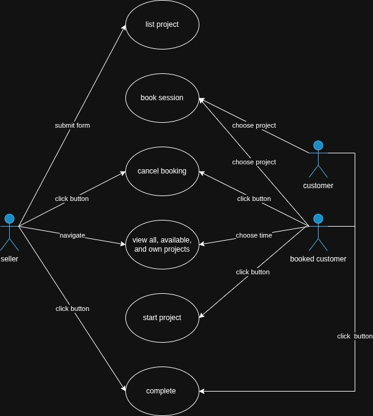

# DApp - The Carving `Block`

**Deployed Contract:** `0xeFA9e9468D8339a63d6f73b5850DBBE8da56B47B`  
**Deployed Frontend:** https://neemz16.github.io/carving-block/

The Carving `Block` is a decentralized marketplace dApp where a single seller can list woodcarving projects for sale for some amount of Yoda tokens. A seller can list a project, which is then booked by a buyer. Once the buyer starts the project funds are sent from the buyer to be held by the smart contract. Once both parties mark the project as complete, the funds are transferred to the seller's wallet. 

  


The contract is written in Solidity and the frontend in React. The frontend uses Firebase as a centralized database. The project is running on the Sepolia testnet.  

## Local Deployment Instructions
Ensure you have npm and node installed. Clone the repository and make sure all dependencies are installed for both the frontend and hardhat:
```
cd carving-block
npm i
cd ../contracts
npm i
cd ..
```

Navigate to [contracts](./contracts/) and start a local hardhat node:
```
npx hardhat node
```  

Deploy contracts using [deployAll.js](./contracts/scripts/deployAll.js):
```
npx hardhat run scripts/deployAll.js --network localhost
```

This should output addresses for Yoda and CarvingBlock. Copy these addresses and paste them into their respective fields at the top of [walletContext.jsx](./carving-block/src/hooks/walletContext.tsx)  

Navigate to [carving-block](./carving-block/) and start the frontend:
```
npm run dev
```
